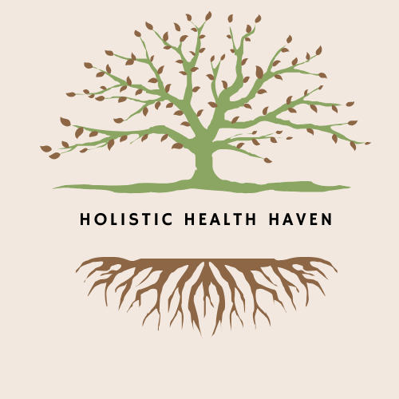

<!-- PROJECT LOGO -->

 

  

  <!-- HEADER -->

<!-- TABLE OF CONTENTS -->

  
Table of Contents

  <ol>
    <li>
      <a href="#about-the-project">About The Project</a>
    <li><a href="#built-with">Built With</a></li>  
    <li><a href="#setup">Setup</a></li>
    <li><a href="#usage">Installation</a></li>
    <li><a href="#usage">Usage</a></li>
    <li><a href="#roadmap">Roadmap</a></li>
    <li><a href="#contact">Contact</a></li>
  </ol>

<!-- ABOUT THE PROJECT -->

## About The Project

Holistic Health Haven is a full-stack e-commerce web application designed to provide a curated selection of organic remedies, herbal supplements, and mindfulness tools through an optimized, user-centered interface.

Through a comprehensive UX audit and redesign process, this application addresses common e-commerce pain points by applying usability heuristics and information hierarchy principles to improve navigation, product discoverability, and checkout flow.

Built using the PERN stack (PostgreSQL, Express, React, Node.js) and TypeScript, this project demonstrates the integration of modern web development practices with user experience design principles, resulting in both improved application performance and enhanced user satisfaction.

### Built With

- ![Figma][Figma-shield]
- ![Canva][Canva-shield]
- ![Miro][Miro-shield]
- ![TypeScript][TypeScript-shield]
- ![React][React-shield]
- ![React Router][React-Router-shield]
- ![Context API][Context-API-shield]
- ![Tailwind CSS][Tailwind-CSS-shield]
- ![Formik][Formik-shield]
- ![Stripe][Stripe-shield]
- ![ESLint][ESLint-shield]
- ![Vercel][Vercel-shield]

(<a href="#readme-top">back to top</a>)

<!-- SETUP -->

## Setup

<!-- DEPLOYMENT LINKS -->

Link to: [Back End](https://github.com/alinix1/holistic-health-haven-BE)

[View Miro](https://miro.com/app/board/uXjVNE2x8xc=/?moveToViewport=-18777,-3658,22606,10992&embedId=565526013409)

[Wireframes](https://www.figma.com/design/CkIDi79gYox7WvqFowN7gg/Holistic-Health-Haven?node-id=0-1&t=dguvDJ6H3FZIUEDP-1)

[Low-fidelity prototypes](https://www.figma.com/design/CkIDi79gYox7WvqFowN7gg/Holistic-Health-Haven?node-id=44-52&t=2HclCi5c23AHgCM8-1)

[High-fidelity static mockups](https://www.figma.com/design/CkIDi79gYox7WvqFowN7gg/Holistic-Health-Haven?node-id=89-2&t=U3lIGeQr5sbHE54S-1)

[High-fidelity prototypes](https://www.figma.com/design/CkIDi79gYox7WvqFowN7gg/Holistic-Health-Haven?node-id=89-2&t=S3ETk28XrPuPULZc-1)

[UX case study](https://docs.google.com/presentation/d/14ClIUr5moaAQVylingeCdfOISpPiT1i098JGzN4riMc/edit?usp=sharing)

(<a href="#readme-top">back to top</a>)

<!-- INSTALLATION -->

## Installation

1. <strong>Clone down frontend repository:</strong>

`git clone https://github.com/alinix1/holistic-health-haven-fe1.git`

2. <strong>Navigate to the project directory:</strong>

`cd holistic-health-haven-fe1`

3. <strong>Install npm packages:</strong>

`yarn install` or `yarn i`

4. <strong>Set up environment variables:</strong>

Create a `.env` file in the root directory:

`REACT_APP_SERVER_URL=http://localhost:9000/api/v1`

5. <strong>Start the development server:</strong>

`yarn start`

<!-- USAGE -->

## Usage

(<a href="#readme-top">back to top</a>)

## Feature Overview

<ul>
 <li><strong>UI/UX Features:</strong>
 <ul>
<li>Custom Carousel</li>
<li>Controlled form using Formik + Yup</li>
<li>Dropdown menu of ailments</li>
<li>Search bar</li>
<li>Cart dropdown menu</li>
<li>Accordion</li>
<li>Modal</li>
<li>Tailwind CSS animations</li>
</ul>
</li>
 
<li><strong>Payment Integration:</strong>
<ul>
<li>Stripe integration for payment</li>
</ul>
</li>
 
<li><strong>Testing and Quality:</strong>
<ul>
<li>ESLint configuration</li>
</ul>
</li>
 
<li><strong>Pages:</strong> 
<ul>
<li>Holistic products page</li>
<li>Holistic details page</li>
<li>Testimonials page</li>
<li>Review page</li>
<li>About page</li>
<li>Privacy policy page</li>
<li>Terms  &amp; conditions page</li>
<li>Checkout page</li>
<li>Payment page</li>
<li> Successful payment page</li>
<li>Bad URL page</li>
</ul>
</li>
</ul>

## Wins:

- Successfully implemented a full-stack application
- Successfully integrated Stripe for a one-time payment
- Optimized and significantly improved performance of the application
- Achieved responsive web design using Tailwind CSS

## Challenges:

- Gaining deeper familiarity with TypeScript
- Refining design architecture for React components and database schema (ERD)
- Optimizing and increasing Lighthouse score

(<a href="#readme-top">back to top</a>)

<!-- ROADMAP -->

## Roadmap

- [ ] End-to-end testing using Playwright
- [ ] Unit and integration testing using React Testing Library
- [ ] User login with email/password and two-factor authentication
- [ ] Order confirmation email

<!-- CONTACT -->

## Contact

Ali Nix | [![LinkedIn][linkedin-shield]][linkedin-url1]

(<a href="#readme-top">back to top</a>)

<!-- MARKDOWN LINKS & IMAGES -->

[Figma-shield]: https://img.shields.io/badge/Figma-F24E1E.svg?style=for-the-badge&logo=Figma&logoColor=white
[Canva-shield]: https://img.shields.io/badge/Canva-%2300C4CC.svg?&style=for-the-badge&logo=Canva&logoColor=white
[Miro-shield]: https://img.shields.io/badge/Miro-050038.svg?style=for-the-badge&logo=Miro&logoColor=white
[TypeScript-shield]: https://img.shields.io/badge/TypeScript-3178C6.svg?style=for-the-badge&logo=TypeScript&logoColor=white
[React-shield]: https://img.shields.io/badge/React-61DAFB.svg?style=for-the-badge&logo=React&logoColor=black
[React-Router-shield]: https://img.shields.io/badge/React%20Router-CA4245.svg?style=for-the-badge&logo=React-Router&logoColor=white
[Axios-shield]: https://img.shields.io/badge/Axios-5A29E4.svg?style=for-the-badge&logo=Axios&logoColor=white
[Context-API-shield]: https://img.shields.io/badge/Context--Api-000000?style=for-the-badge&logo=react
[Tailwind-CSS-shield]: https://img.shields.io/badge/Tailwind%20CSS-06B6D4.svg?style=for-the-badge&logo=Tailwind-CSS&logoColor=white
[Formik-shield]: https://img.shields.io/badge/Formik-2563EB.svg?style=for-the-badge&logo=Formik&logoColor=white
[Stripe-shield]: https://img.shields.io/badge/Stripe-635BFF.svg?style=for-the-badge&logo=Stripe&logoColor=white
[Testing-Library-shield]: https://img.shields.io/badge/Testing%20Library-E33332.svg?style=for-the-badge&logo=Testing-Library&logoColor=white
[Playwright-shield]: https://img.shields.io/badge/Playwright-45ba4b?style=for-the-badge&logo=Playwright&logoColor=white
[ESLint-shield]: https://img.shields.io/badge/eslint-3A33D1?style=for-the-badge&logo=eslint&logoColor=white
[Vercel-shield]: https://img.shields.io/badge/Vercel-000000?style=for-the-badge&logo=vercel&logoColor=white
[linkedin-shield]: https://img.shields.io/badge/-LinkedIn-black.svg?style=for-the-badge&logo=linkedin&colorB=555
[linkedin-url1]: https://www.linkedin.com/in/ali-nix-38b9b9126/
